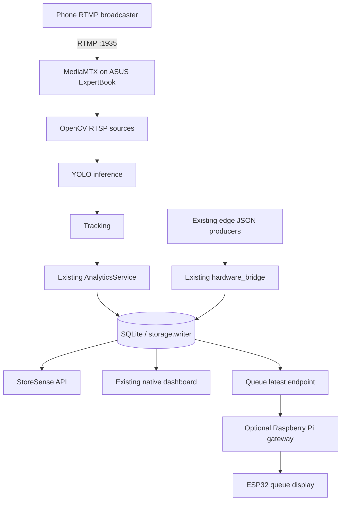

# StoreSense Server Architecture

The ASUS ExpertBook server is the central source of truth. The current
application keeps the existing Python pipeline, SQLite storage, native
dashboard, and JSON hardware bridge; the server additions are adapters around
those boundaries rather than a second analytics system.



## Components

- `deploy/mediamtx/`: local RTMP ingress and RTSP relay configuration.
- `adapters/video/opencv_rtsp_source.py`: reconnecting OpenCV RTSP input.
- `adapters/inference/ultralytics_engine.py`: YOLO adapter.
- `services/live_pipeline.py`: multi-camera orchestration using the existing
  `PipelineRunner` and `AnalyticsService`.
- `api/server.py`: repository-backed `/health`, `/api/metrics`,
  `/api/v1/cameras`, and `/api/v1/queue/latest` endpoints.
- `integrations/edge_gateway.py`: optional HTTP publisher for the latest queue
  value. It retries on the next interval after a Raspberry Pi outage.

## Camera configuration

Do not invent phone addresses. Copy `.env.example` to `.env` and provide the
actual stream URLs or a base URL whose paths are registered in MediaMTX.

```text
STORESENSE_CAMERA_IDS=entry-cam,queue-cam-1,queue-cam-2,shelf-cam-1
STORESENSE_RTSP_BASE_URL=rtsp://127.0.0.1:8554
```

For four phones publishing into MediaMTX, use an RTMP broadcaster (not an RTSP
viewer) and configure the phone apps with the server LAN IP and these paths:

```text
rtmp://<server-lan-ip>:1935/entry-cam
rtmp://<server-lan-ip>:1935/queue-cam-1
rtmp://<server-lan-ip>:1935/queue-cam-2
rtmp://<server-lan-ip>:1935/shelf-cam-1
```

For direct phone pull, override individual URLs in `.env`:

```text
STORESENSE_RTSP_URL_ENTRY_CAM=http://<phone-1-ip>:8080/video
STORESENSE_RTSP_URL_QUEUE_CAM_1=http://<phone-2-ip>:8080/video
STORESENSE_RTSP_URL_QUEUE_CAM_2=http://<phone-3-ip>:8080/video
STORESENSE_RTSP_URL_SHELF_CAM_1=http://<phone-4-ip>:8080/video
```

## Raspberry Pi and ESP32 contract

The server publishes the latest queue metric as JSON with HTTP `POST`:

```json
{
  "queue_count": 7,
  "camera_id": "queue-cam-1",
  "zone_id": "checkout-1",
  "timestamp": "2026-09-13T12:00:00+00:00"
}
```

Configure the Pi endpoint with `STORESENSE_EDGE_GATEWAY_URL`. The Raspberry Pi
may translate this payload to the ESP32's existing display protocol. No ESP32
or Raspberry Pi implementation currently exists in either repository, so no
physical device behavior is claimed here.

## Startup

Local development:

```powershell
python start_storesense.py --dev-mode --no-hardware
```

Server with configured RTSP streams:

```bash
docker compose -f deploy/mediamtx/docker-compose.yml up -d
python scripts/check_live_cameras.py
python start_storesense.py --no-hardware --live-ai
```

For CasaOS, import the MediaMTX Compose file as a custom application and run
the StoreSense Python process on the same server with the same `.env` values.
